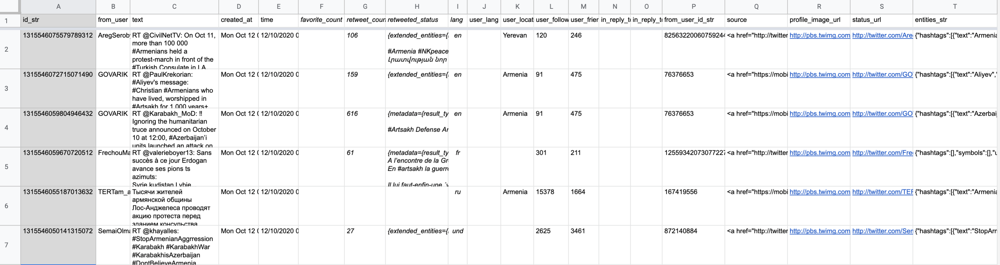
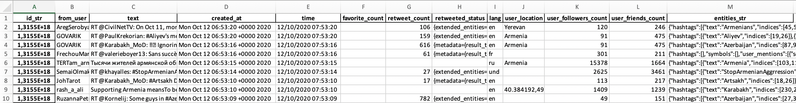

# Social Media Analytics 2020 - student project
  
  
## Overview

The project is centered on Twitter data analysis since it’s the most affordable platform for educational research, and there are several handy tools available for analysis, like [TAGS](https://tags.hawksey.info/).

Since there’s no possibility to access historical data, I focus on current events (_6-12 October (Tue-Mon) 2020_), and one of the most prominent ones is a military conflict between Armenia and Azerbaijan over [disputed territories](https://en.wikipedia.org/wiki/Nagorno-Karabakh), denoted by the “**#karabakh OR #artsakh**” hashtags on Twitter.

---

## Main points of the exercise

- read a very large Google Sheets data file and clean it
- write processed data back to .xlsx file
- process resulting .xlsx file locally

All processing is done in Python (v. 3.8.) using [Jupyter Notebooks](https://jupyter.org/).
  
  
## Obstacles

1. Very large Google Sheets data file

   When [TAGS software](https://tags.hawksey.info/) generates a Google Sheets data file of around 187000 records, it's almost impossible to work with it in the browser. Therefore one has to download it to local machine.

2. It's impossible to download a large Google Sheets data file without errors

   Upon downloading to local machine as an .xlsx file, Excel detects errors and at least in MacOS version, it is unable to fix them.
  
  
## Solutions

1. Read in Google Sheets data file in [Google Colab](https://colab.research.google.com/), process it (clean) and save as an .xlsx file (in order to save space)
   - see [`1_get_data_from_googlesheets.ipynb`](1_get_data_from_googlesheets.ipynb)
2. Download resulting (much smaller) data file to a local machine
3. Process data locally with `pandas` and other libraries, generate [WordCloud](https://en.wikipedia.org/wiki/Tag_cloud) image
   - see [`2_tweets.ipynb`](2_tweets.ipynb)

---

## Data and results

1. Original Google Sheets data sample:
   

2. Downloaded .xlsx data sample:
   

3. WordCloud resulting image:
   

4. Final project report: [`PDF`](Project_Report.pdf)

5. 
